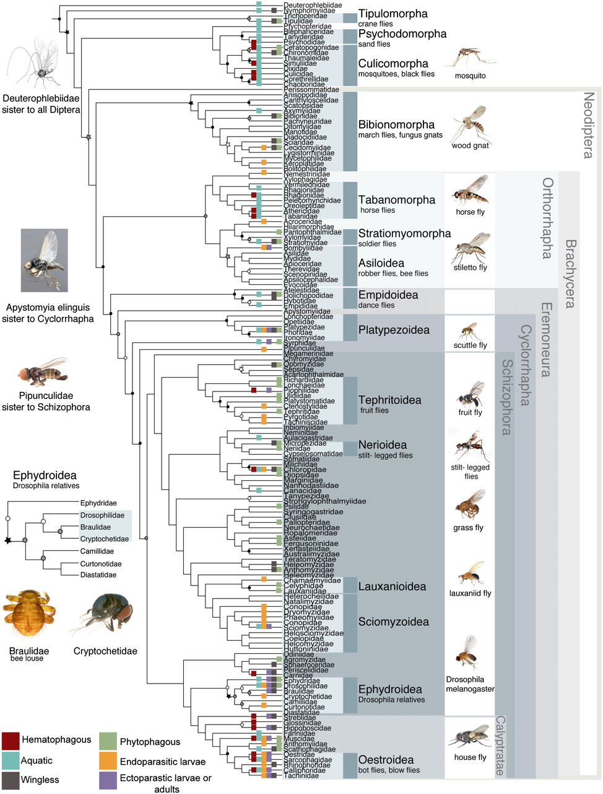
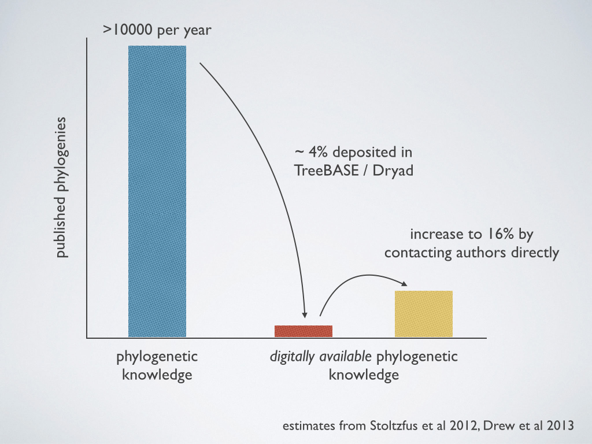

### How should we build a tree of about 2.6 million tips?

  1. Supermatrix
    * Create a huge matrix of all available data,
    * Use parsimony, distance, likelihood, or Bayesian methods to estimate a tree

### How should we build a tree of about 2.6 million tips?

  1. Supermatrix
    * Create a huge matrix of all available data,
    * Use parsimony, distance, likelihood, or Bayesian methods to estimate a tree

### Problems:
  1. Hard to establish homology on this scale.
  2. Few models are appropriate on this scale.
  3. Hard to compute a reliable answer on this scale.
  4. **Lots** of missing data.

### How should we build a tree of about 2.6 million tips?

  1. <strike>Supermatrix</strike>
  2. Supertree analyses

### Supertree analyses
  1. Gather a large set of partially overlapping estimated trees - These will be the data.
  1. Define an optimality criterion or procedure for resolving conflict.
  3. Produce a "supertree" that has all of the species
  in the sample.

