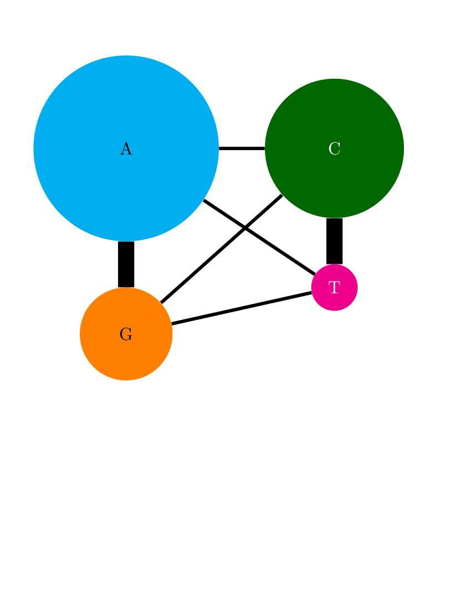
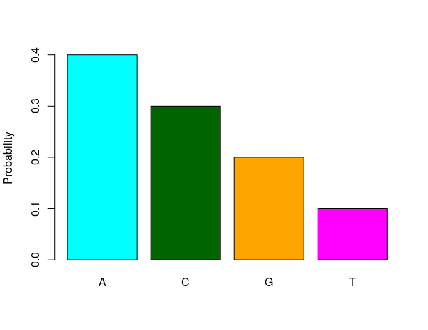
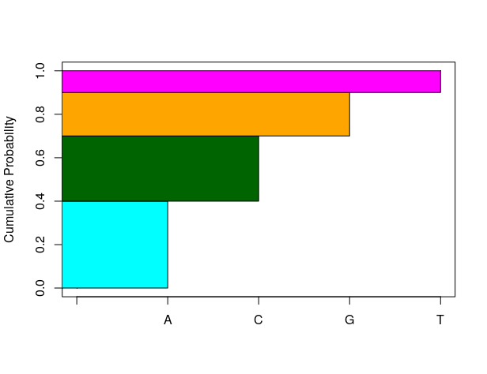
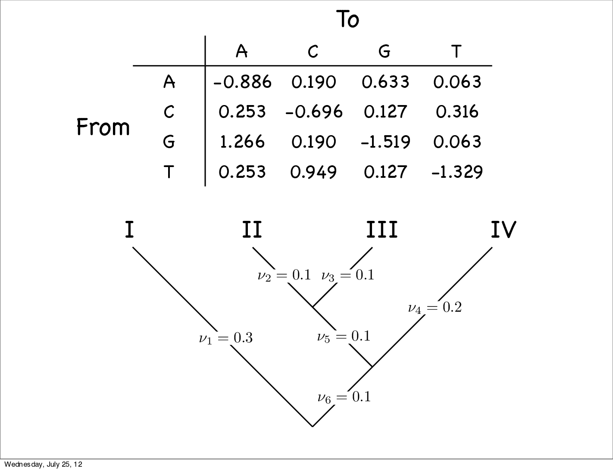

### John Huelsenbeck's character simulation with dice

  * Taken from John's [lecture at the Woods Hole Workshop on Molecular Evolution](https://molevol.mbl.edu/images/1/1a/WoodsHole2012_1.pdf)

**HKY model**
`\begin{eqnarray}
\mathbf{Q} & = & \left(\begin{array}{rrrr}- & \pi_C & \kappa\pi_G & \pi_T \\
	\pi_A & - & \pi_G & \kappa\pi_T \\ \kappa\pi_A & \pi_C & - & \pi_T \\
	\pi_A & \kappa\pi_C & \pi_G & - \end{array}\right)\\
	\kappa & = & 5 \\
		\pi_A & = & 0.4 \\
		\pi_C & = & 0.3 \\
		\pi_G & = & 0.2 \\
		\pi_T & = & 1 -\pi_A - \pi_C - \pi_G= 0.1 
\end{eqnarray}`

**Equilibrium base frequencies of our HKY model**
`\begin{eqnarray}
		\pi_A & = & 0.4 \\
		\pi_C & = & 0.3 \\
		\pi_G & = & 0.2 \\
		\pi_T & = & 1 -\pi_A - \pi_C - \pi_G= 0.1 
\end{eqnarray}`

 

### Rate matrix of our specific HKY model
`\begin{eqnarray}
\mathbf{Q} & = & \left(\begin{array}{rrrr} -0.886 &  0.190 & 0.633 & 0.063 \\ 0.253 & -0.696 & 0.127 & 0.316 \\ 1.266 & 0.190 & -1.519 & 0.063 \\ 0.253 & 0.949 & 0.127 & -1.329 \end{array}\right)\end{eqnarray}`

