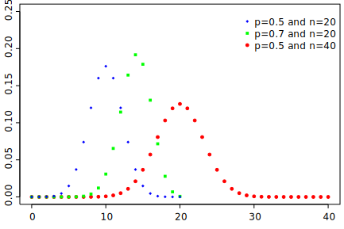
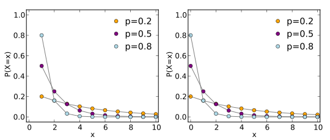
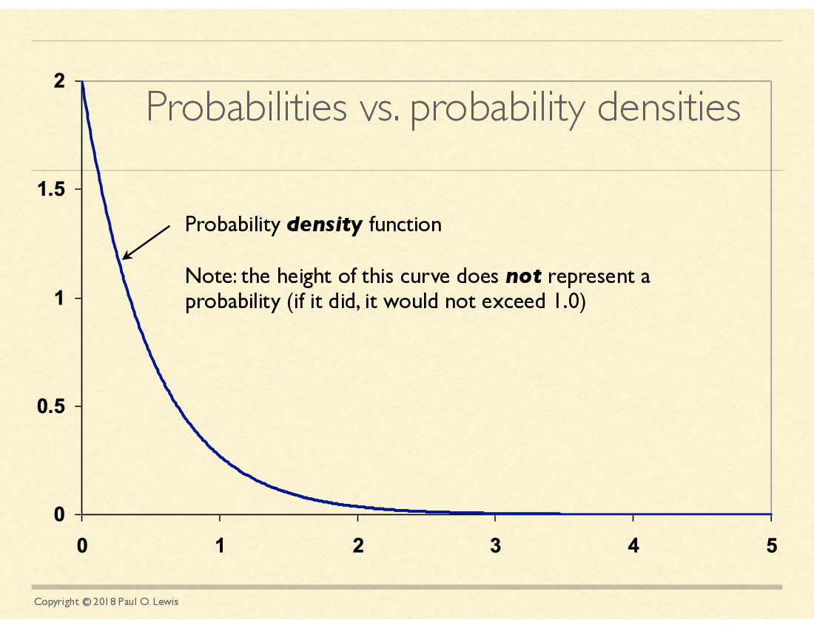
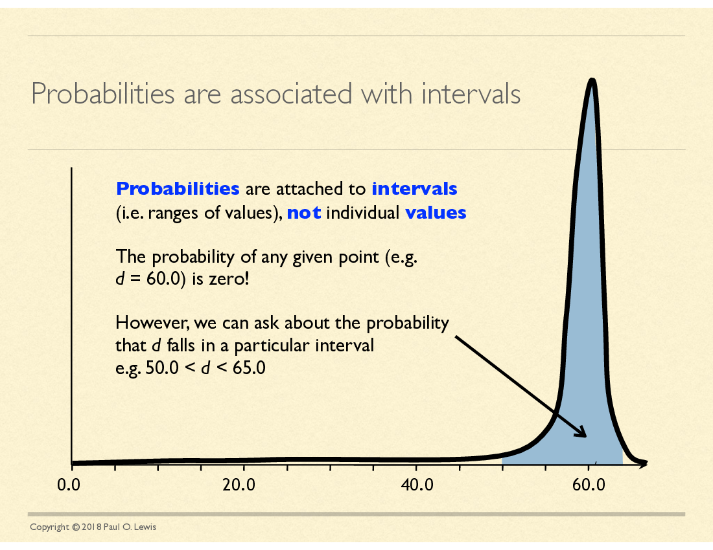
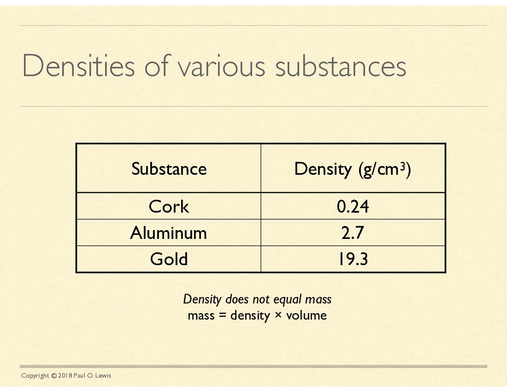
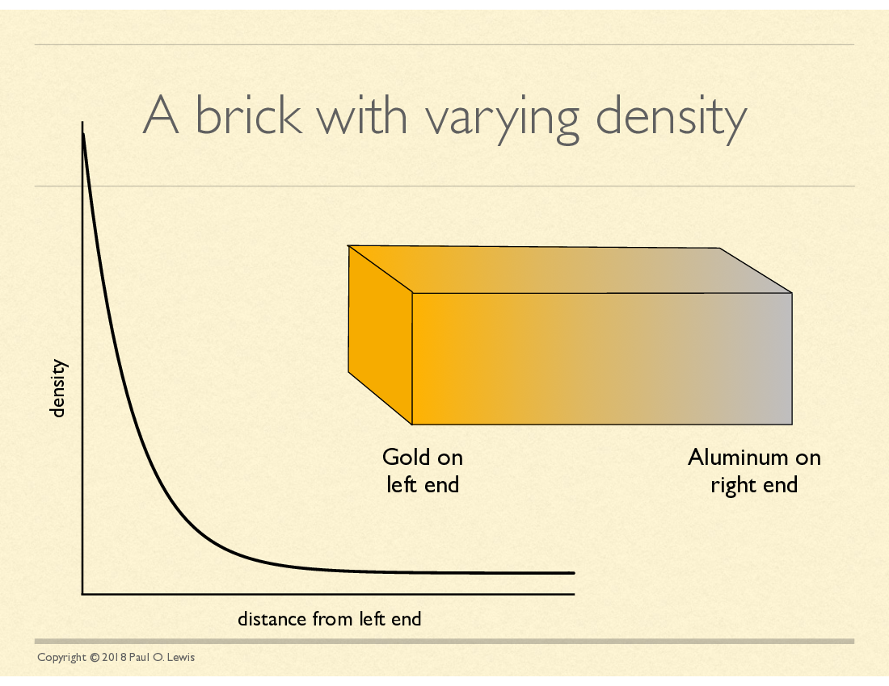
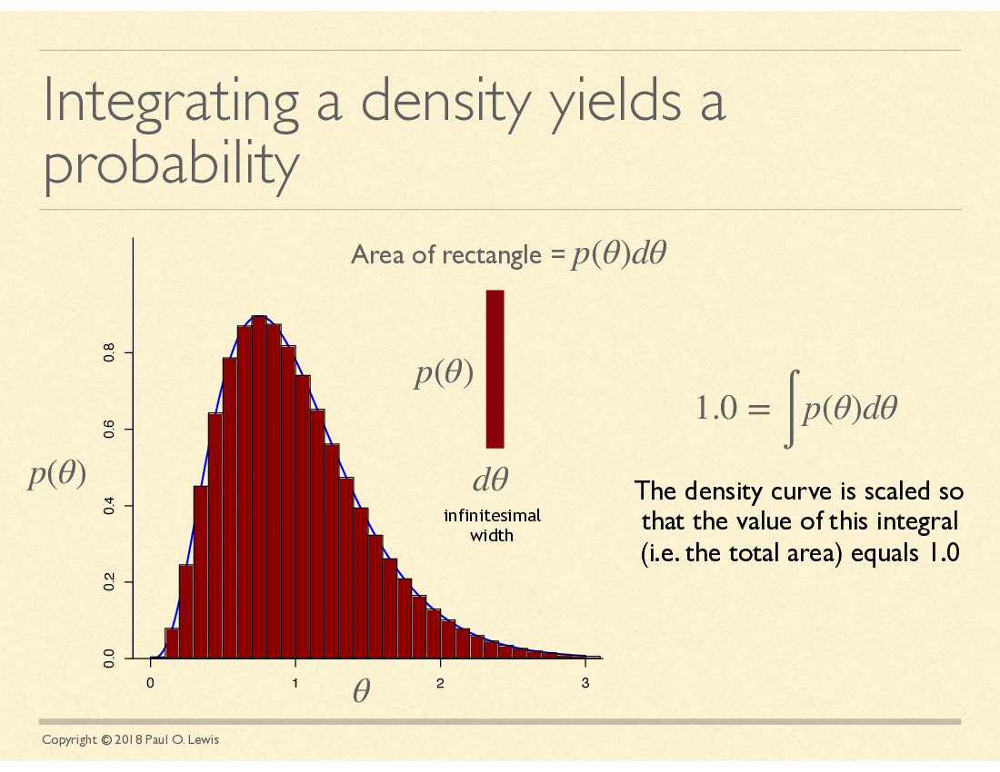
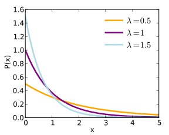

### John Huelsenbeck's character simulation with dice

  * Taken from John's [lecture at the Woods Hole Workshop on Molecular Evolution](https://molevol.mbl.edu/images/1/1a/WoodsHole2012_1.pdf)

**HKY model**
`\begin{eqnarray}
\mathbf{Q} & = & \left(\begin{array}{rrrr}- & \pi_C & \kappa\pi_G & \pi_T \\
	\pi_A & - & \pi_G & \kappa\pi_T \\ \kappa\pi_A & \pi_C & - & \pi_T \\
	\pi_A & \kappa\pi_C & \pi_G & - \end{array}\right)\\
	\kappa & = & 5 \\
		\pi_A & = & 0.4 \\
		\pi_C & = & 0.3 \\
		\pi_G & = & 0.2 \\
		\pi_T & = & 1 -\pi_A \pi_C - \pi_G= 0.1 
\end{eqnarray}`

### Our specific HKY model
`\begin{eqnarray}
\mathbf{Q} & = & \left(\begin{array}{rrrr} -0.886 &  0.190 & 0.633 & 0.063 \\ 0.253 & -0.696 & 0.127 & 0.316 \\ 1.266 & 0.190 & -1.519 & 0.063 \\ 0.253 & 0.949 & 0.127 & -1.329 \end{array}\right)\end{eqnarray}`

### Bayes' rule
`\begin{eqnarray}
\Pr(A \mid B) & = &  \frac{\Pr(A, B)}{\Pr(B)}
\end{eqnarray}`
 
`\begin{eqnarray}
\Pr(D\mid +)  & = & \frac{\Pr(D,+)}{\Pr(+)} \\
\Pr(+) & = & ?
\end{eqnarray}`

### Law of total probability
`\begin{eqnarray}
\Pr(A) & = & \sum_{i\in\mathcal{B}} {\Pr(A\mid B=i)}{\Pr(B=i)}
\end{eqnarray}`
 
`\begin{eqnarray}
\Pr(+) & = & \Pr(+\mid H)\Pr(H) + \Pr(+\mid D)\Pr(D) \\
& = & 0.1\times 0.92 + 0.95\times 0.08 \\
& = & 0.168
\end{eqnarray}`

### Bayes' rule (again)
`\begin{eqnarray}
\Pr(D\mid +)  & = & \frac{\Pr(D,+)}{\Pr(+)} \\
\Pr(+) & = & 0.168 \\
\Pr(D,+) & = & 0.95\times 0.08 = 0.076 \\
\Pr(D\mid +)  & = & 0.076 / 0.168 \\
& = & 0.452
\end{eqnarray}`

<a href="./bayesgraph.html" target="_blank">Bayes' rule graphically</a>

### Bayes' rule
`\begin{eqnarray}
\Pr(D\mid +)  & = & \frac{\Pr(D,+)}{\Pr(+)} \\
\Pr(+) & = & 0.168 \\
\Pr(D,+) & = & 0.95\times 0.08 = 0.076 \\
\Pr(D\mid +)  & = & 0.076 / 0.168 \\
& = & 0.452
\end{eqnarray}`

### Some Common Discrete Probaility Distributions...

(with nice images from the wonderful folks who contribute to Wikipedia)...

If you have *n* trials each which has the same probability of
success (call that *p*), what is the probability of exactly *k* successes?
 **Binomial distribution:**
`$$\Pr(k\mid n, p) = {n\choose k} p^k (1-p)^{n-k}$$`

Imagine you perform independent trials until your first success.
If the probability of a success on each trial is *p*, what is the
probability that the first success will occur on trial *k*? (waiting time=*k* trials)
 **Geometric distribution:**
`$$\Pr(k\mid p) = (1-p)^{k-1}p $$`

Imagine independent events happen at the same rate *r* over a time
interval of *t*. If `$\lambda = rt$`, what is the probability
that exactly *k* events occur?
 **Poisson distribution:**
`$$\Pr(k\mid \lambda) = \frac{\lambda^k e^{-\lambda}}{k!}$$`

### Continuous probability distributions
Used when the random variable can be any number on a part 
of the number line (not restricted to integers)

### Some Common Continuous Probaility Distributions...

(once again, with nice images from the wonderful folks who contribute to Wikipedia)...

If *x* is the sum of a very large number of random variables,
it will follow the 
 **Normal distribution:**
`$$f(x\mid \mu, \sigma) = \frac{1}{\sqrt{2\pi\sigma^2}}e^{-\frac{(x-\mu)^2}{2\sigma^2}}$$`

If events occur at a constant rate `$\lambda$`, and
*x* is the 
waiting time to the first event, *x* will follow the:
 **Exponential distribution:**
`$$f(x\mid \lambda) = \lambda e^{-\lambda x}$$`

The exponential is the continuous form of the geometric distribution:

If *x* is the sum of *k* Exponential(`$\lambda = 1/\theta$`) variables,
*x* will follow a  **Gamma distribution:**
`$$f(x\mid k, \lambda) = \frac{\lambda^k}{\Gamma(k)} x^{k-1} e^{-\lambda x}$$`

For the next set of slides, see 
<a href="./midwest-phylo-likelihood.html">midwest-phylo-likelihood.html</a> ...

