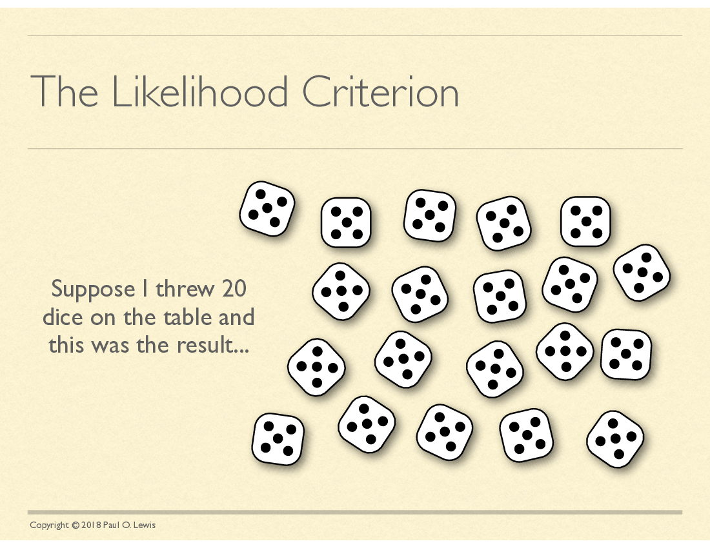
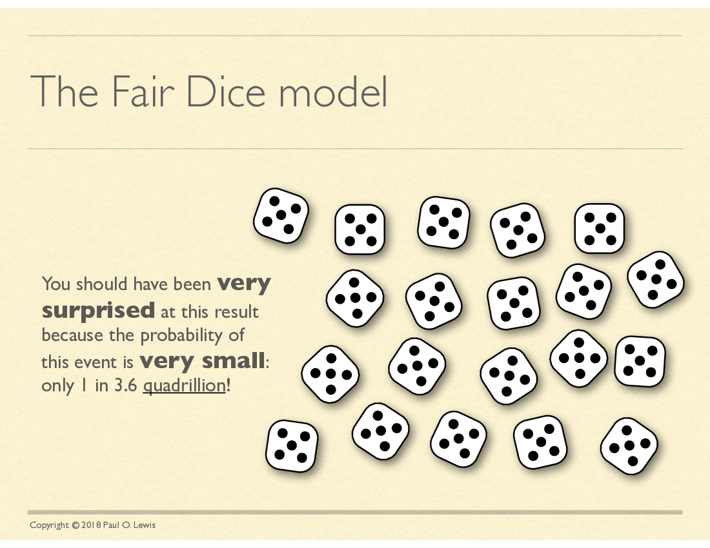
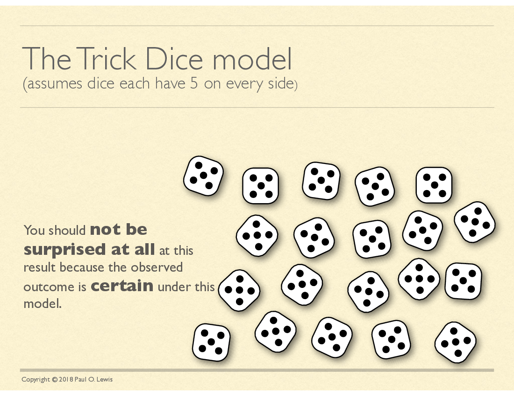
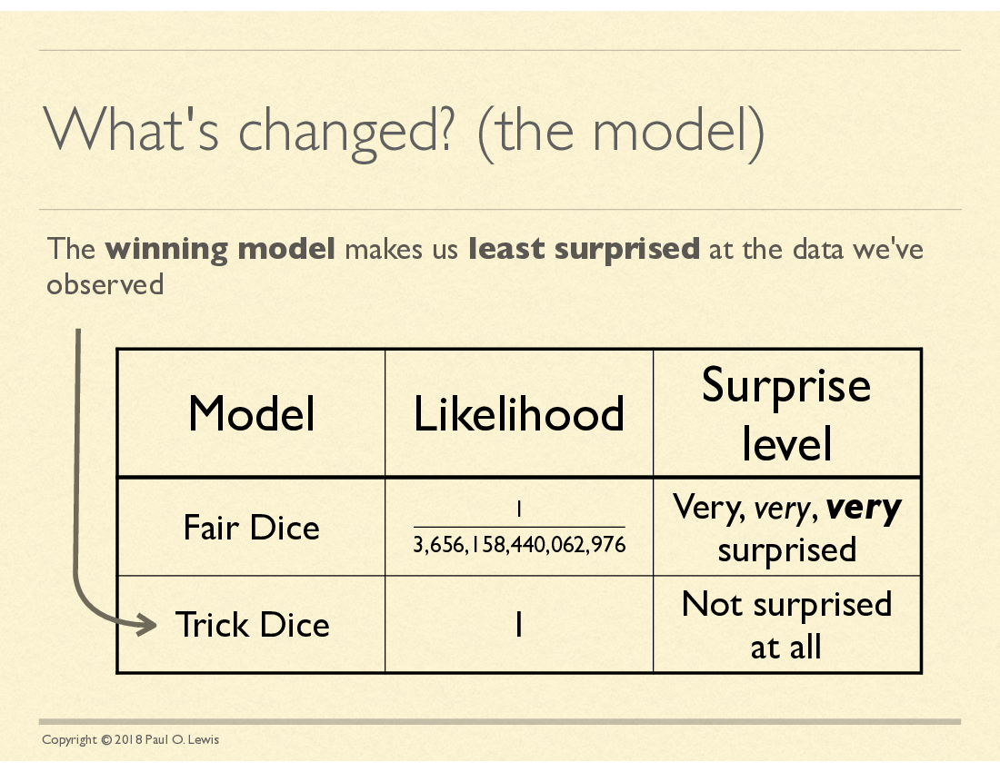
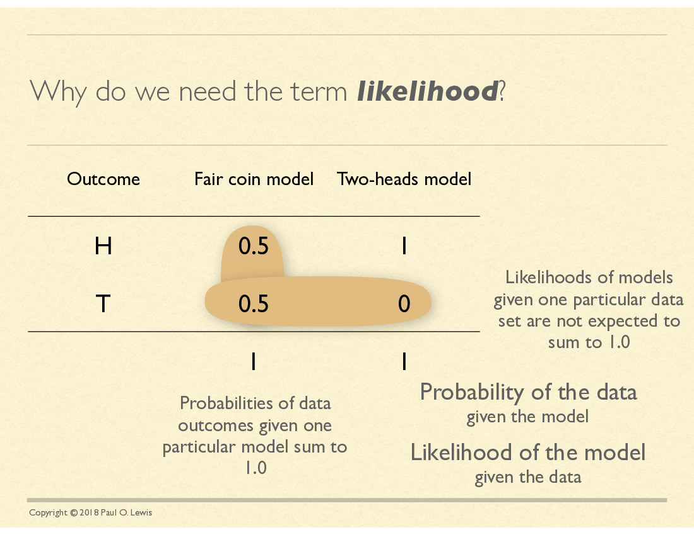

### Likelihood

  * Measures fit of different models to your data
  * the [likelihood principle](https://en.wikipedia.org/wiki/Likelihood_principle): if you have 2 different probability models, **all** of the information in the data
  is conveyed by  the likelihood ratio between the models

### Bear in mind...

  * Not all scientific hypotheses map directly to a probabilistic model
  * the likelihood principle indicates that likelihood is statistically
  powerful, but robustness matters too!
      * *power*: ability to distinguish different models
      * *robustness*: giving good answers even when assumptions are violated

### Likelihood (definition)

The *likelihood of a model* is the probability of
	getting a data set identical to what your data, 
	*if that model is true*.

`\begin{eqnarray}
L(\theta)  & = & \Pr(X\mid \theta) 
\end{eqnarray}`

If you have *n* independent samples:

`\begin{eqnarray}
L(\theta)  =  \Pr(X\mid \theta) & = & \prod_{i=1}^n \Pr(x_i \mid \theta)
\end{eqnarray}`

### Toy example: serial sampling of 1 site over time

Imagine:

  * we observe a lineage evolving.
  * Every 10,000 generations we sequence the locus, and note what
	base is at our site of interest. (I guess we have a 
	time machine - 😎)
  * We want to estimate the **probability that the site will be different
	the next time we sample**.

([more detailed write up](http://phylo.bio.ku.edu/mephytis/tex/discrete-time-and-state-Markov.pdf))

