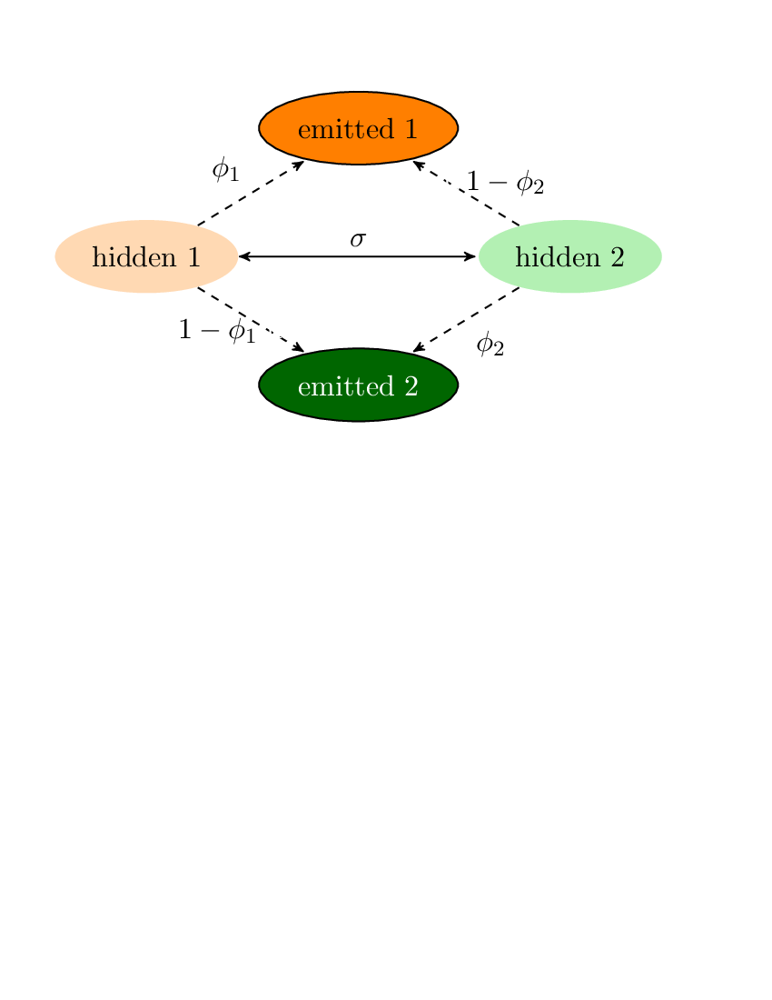

### Likelihood

  * Measures fit of different models to your data
  * the [likelihood principle](https://en.wikipedia.org/wiki/Likelihood_principle): if you have 2 different probability models, **all** of the information in the data
  is conveyed by  the likelihood ratio between the models

### Bear in mind...

  * Not all scientific hypotheses map directly to a probabilistic model
  * the likelihood principle indicates that likelihood is statistically
  powerful, but robustness matters too!
      * *power*: ability to distinguish different models
      * *robustness*: giving good answers even when assumptions are violated

### Likelihood (definition)

The *likelihood of a model* is the probability of
	getting a data set identical to what your data, 
	*if that model is true*.

`\begin{eqnarray}
L(\theta)  & = & \Pr(X\mid \theta) 
\end{eqnarray}`

If you have *n* independent samples:

`\begin{eqnarray}
L(\theta)  =  \Pr(X\mid \theta) & = & \prod_{i=1}^n \Pr(x_i \mid \theta)
\end{eqnarray}`

### Toy example: serial sampling of 1 site over time

  * We observe a lineage evolving.
  * Every 10,000 generations we sequence the locus, and note what
	base is at our site of interest.
  * I guess we have a time machine 😎
  * Click [here](http://phylo.bio.ku.edu/mephytis/tex/discrete-time-and-state-Markov.pdf)  for a more detailed write up
  * We want to estimate "*s*", the **probability that the site will be different
	the next time we sample**.
  * Our data might look like: <tt>GGCCCCCCCA</tt> for 10 sample points

**Toy example: Simplest model**
  * *s* is the same over every interval between adjacent samples
  * each alternative base is equally likely whenever a substitution occurs.

*X* = <tt>GGCCCCCCCA</tt>, or (for indexing):

| i | 1 | 2 | 3 | 4 | 5 | 6 | 7 | 8 | 9 | 10 |
|---|---|---|---|---|---|---|---|---|---|---|
| `$x_i$` | G | G | C | C | C | C | C | C | C | A |

What is `$Pr(X \mid s)$` ?  

| i | 1 | 2 | 3 | 4 | 5 |
|:-:|:-:|:-:|:-:|:-:|:-:|
| `$x_i$` | G | G | C | C | C |
| `$\Pr(x_i\mid s) =$` | `$\left(\frac{1}{4}\right)$` | `$\left(1-s\right)$` | `$\left(\frac{s}{3}\right)$` | `$\left(1 - s\right)$` | `$\left(1 - s\right)$` |

  * `$n_d$` = number of adjacent sites that are different
  * `$n_s$` = number of adjacent sites that are same
`\begin{eqnarray}
L(s)  =  \Pr(X\mid s) & = & \prod_{i=1}^n \Pr(x_i \mid s) \\
& = & \frac{1}{4} (1-s)^{n_d}\left(\frac{s}{3}\right)^{n_s}
\end{eqnarray}`

### Demo

Checkout <a href="http://phylo.bio.ku.edu/mephytis/disc-state-disc-time-Markov/index.html" target="_blank">http://phylo.bio.ku.edu/mephytis/disc-state-disc-time-Markov/index.html</a>

### Missing data Demo

Also note the ML deals with missing data nicely <a href="http://phylo.bio.ku.edu/mephytis/disc-state-disc-time-Markov/missing.html" target="_blank">http://phylo.bio.ku.edu/mephytis/disc-state-disc-time-Markov/missing.html</a>

**A more difficult inference problem**

  * Previous demos were discrete-state, discrete-time Markov
	model.
  * In phylogenetics we often deal with hidden Markov models, which
  have states that we cannot observe.

Check out <a target="_blank" href="https://github.com/mtholder/urn_demo/blob/master/README.md">https://github.com/mtholder/urn_demo/blob/master/README.md</a>
for a instructions for a hands-on demo.

### Demo Takehome messages #1

Max. Likelihood is quite powerful and generalizable means of making estimation and testing

### Demo Takehome messages #2

  * The power to learn one model/parameter can be strongly influenced by other parameters
  in the model.
  * Imagine if both urns had 4 orange and 4 green beads. Could you estimate *s*?
  * When designing a study - you need to have a good sense of where the 
  signal is coming from!

### Demo Takehome messages #3

  * The power to learn one model/parameter can be strongly influenced by stochastic events
  * If each urn had exactly 1 "contaminant" can you be confident that *C=1*?
  * When designing a study - you need to have a good sense of where the 
  signal is coming from!

