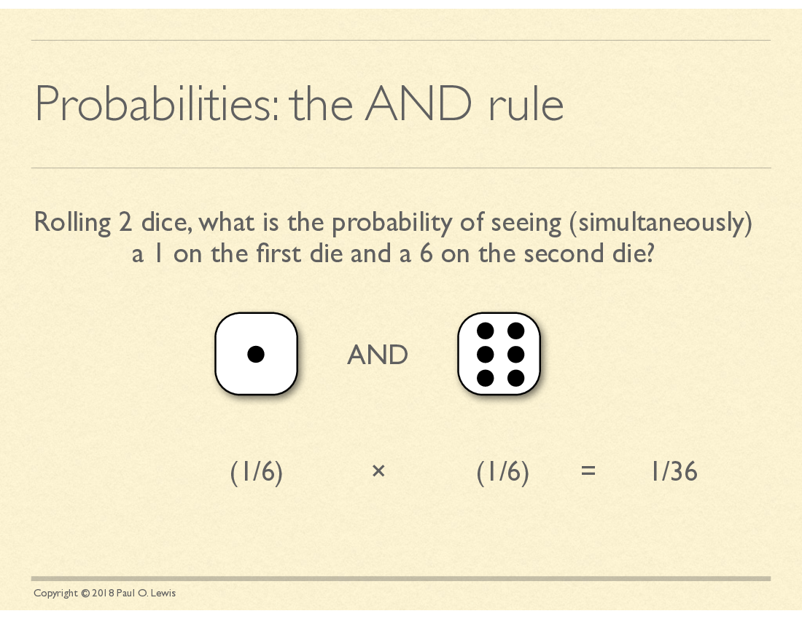
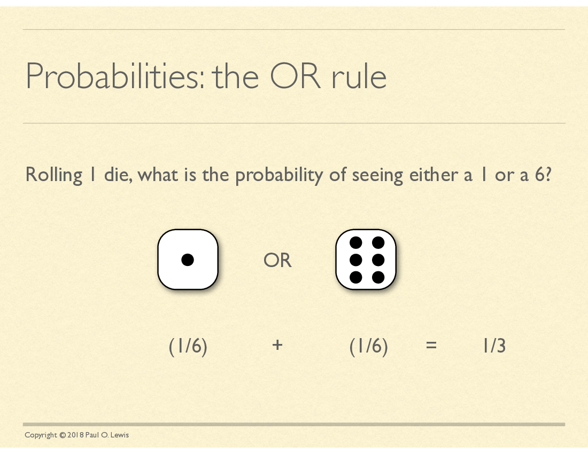
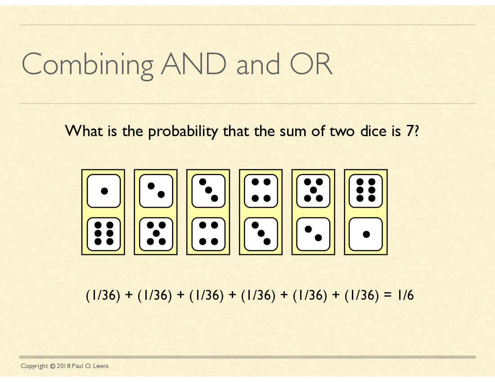
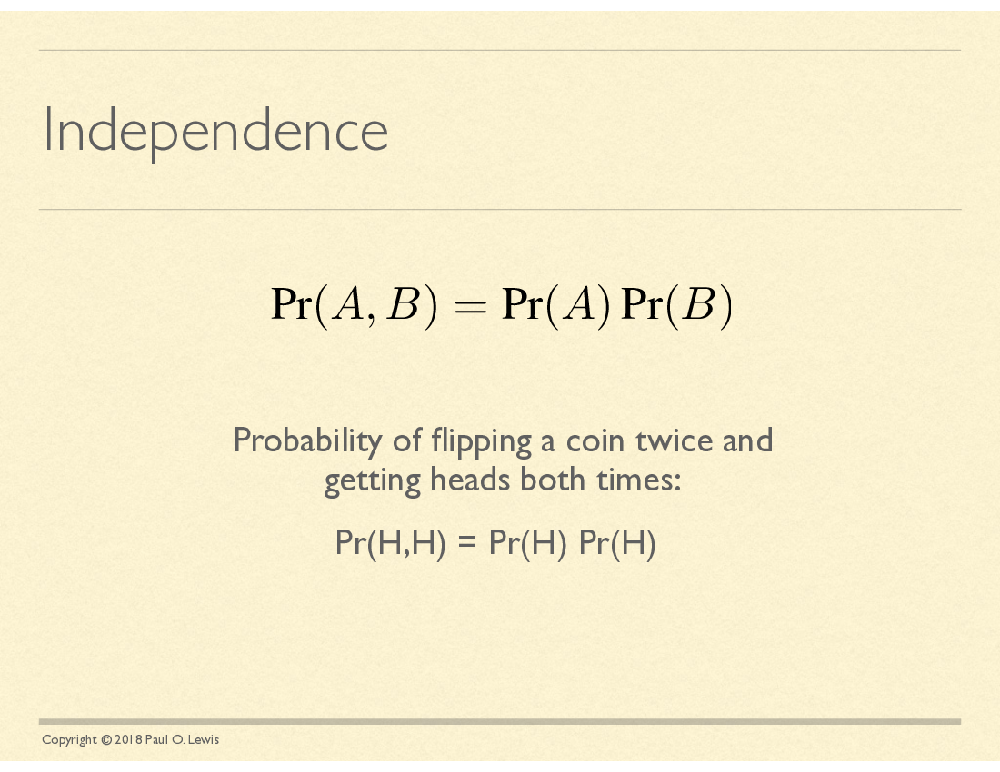
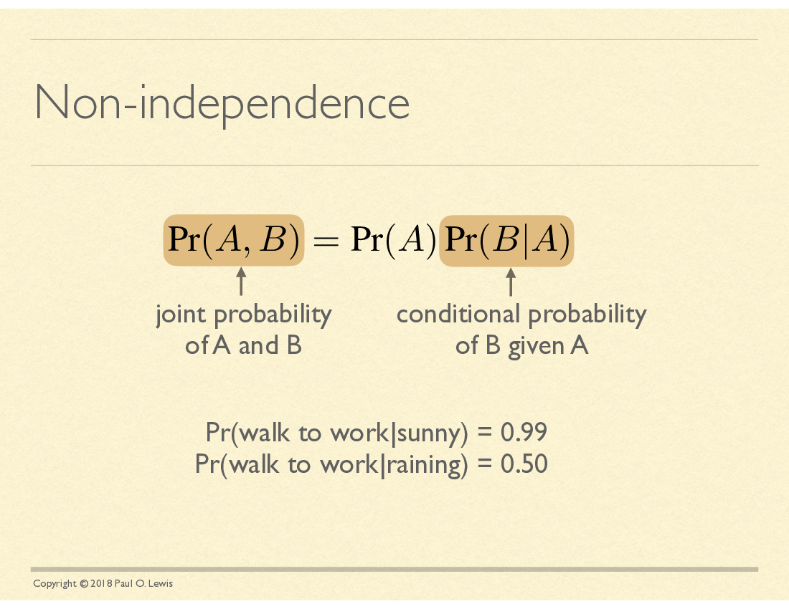
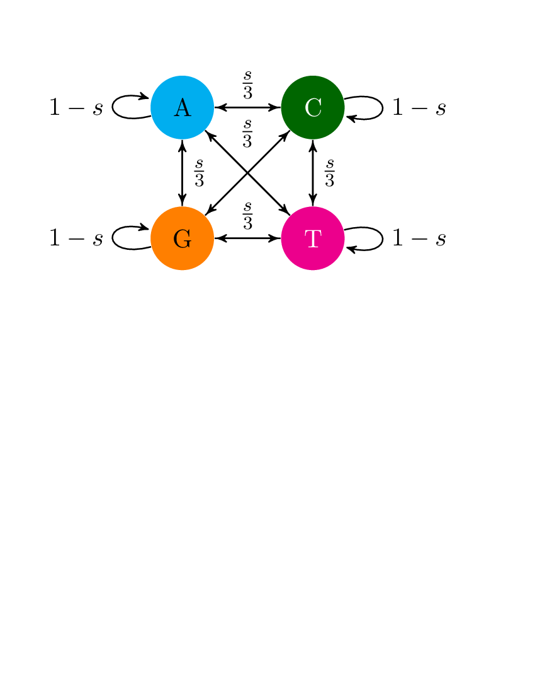

### Outline

  * Review of rules of probability
  * likelihood
  * basic likelihood demo
  * likelihood for a hierarchical model demo

A disease is found in 8% of the population.
A diagnostic test has a false positive rate of 10%, and
a false negative rate of 5%.
If someone has a positive result, what is the chance that they have the disease?

A disease is found in 8% of the population.
A diagnostic test has a false positive rate of 10%, and
a false negative rate of 5%.
If someone has a positive result, what is the chance that they have the disease?

`\begin{eqnarray}
\Pr(D) & = & 0.08 \\
\Pr(+\mid H) & = & 0.1 \\
\Pr(-\mid D) & = & 0.0.5 \\
\Pr(D\mid +) & = & ?
\end{eqnarray}`

### Bayes' rule
`\begin{eqnarray}
\Pr(A \mid B) & = &  \frac{\Pr(A, B)}{\Pr(B)}\\
\Pr(D\mid +)  & = & \frac{\Pr(D,+)}{\Pr(+)} \\
\Pr(+) & = & ?
\end{eqnarray}`

### Law of total probability
`\begin{eqnarray}
\Pr(A) & = & \sum_{i\in\mathcal{B}} {\Pr(A\mid B=i)}{\Pr(B=i)}\\
\end{eqnarray}`

`\begin{eqnarray}
\Pr(+) & = & \Pr(+\mid H)\Pr(H) + \Pr(+\mid D)\Pr(D)
\end{eqnarray}`

