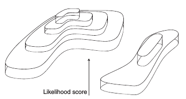

### Using all data

Cons:
  * Can create long branches by lack of data for some tips or
     increasing the size of tree
  * Poor data overlap between taxa can lead to rogue taxa and terraces

Pros:
  * Uses all the data
  * Helps you spot the weakness in your phylogenetic argument

### Conclusions

  * Readers want to know how your phylogenetic model fits with all available data
  * More convincing to present full data, and **interrogate** analyses for causes of incongruence
  * That doesn't mean the "total evidence" tree

### One recent example

[Dell'Ampio *et al.* (2014)](http://mbe.oxfordjournals.org/content/31/1/239) finds
  indecisive data sets still can contribute strong support of
Entognatha: (Collembola+Protura+Diplura)
  * not supported by their preferred `M_Ento` data set
  * 81% BP in an alternative with 253 loci only 79 cover C+P+D
  * up to 94% BP when these 79 loci are removed!

See [MARE software](https://www.zfmk.de/de/forschung/forschungszentren-und-gruppen/mare).

## Interaction effects

  * Missing data × model misspecification
  * Missing data × model partitioning
  * Missing data × analysis method
  * Missing data × ascertainment biases
  * Missing data × tree depth

### Missing data × model misspecification

  * Both [Lemmon *et al.* (2009)](http://sysbio.oxfordjournals.org/content/58/1/130) and
 [Roure *et al.* (2013)](http://mbe.oxfordjournals.org/content/30/1/197.abstract)
find that artificial data from 2 tips (or 1 tip) can mislead tree preference by 
**contaminating parameter estimates**.
  * Conditions were contrived, but still indicates troubling lack of robustness.

### Missing data × model misspecification

  * Our models of substitution are not good enough to deal with deep divergences.

Figure 2 from [Pisani *et al.* (2015)](http://www.pnas.org/cgi/doi/10.1073/pnas.1518127112) results from
[PhyloBayes CAT model](http://megasun.bch.umontreal.ca/People/lartillot/www/index.htm) analyses.

### Missing data × model partitioning

In a partitioned model, do the subsets of the data share
  the same substitution parameter, relative edge lengths, 
  or mean subset rate? Or some combination of parameter sharing...

  * "unlinking" parameters avoids errors caused by "parameter contamination" when loci evolve differently.
  * It causes terraces in likelihood space - See [Sanderson *et al.*, 2015](http://sysbio.oxfordjournals.org/content/64/5/709.full.pdf+html)
  and references therein

(from Figure 2 of [Sanderson *et al.*, 2015](http://sysbio.oxfordjournals.org/content/64/5/709.full.pdf+html))

(Figure 1 of [Sanderson *et al.*, 2015](http://sysbio.oxfordjournals.org/content/64/5/709.full.pdf+html))

(Figure 4 of [Sanderson *et al.*, 2015](http://sysbio.oxfordjournals.org/content/64/5/709.full.pdf+html))

### Missing data × model partitioning

Damned if you do partition:
  * Terraces 
    * complicate tree searching (but see [Chernomour *et al.* (2016)](http://sysbio.oxfordjournals.org/content/early/2016/04/26/sysbio.syw037.short)
  and recent work in [RAxML](http://sco.h-its.org/exelixis/software.html))
    * Can inflate BP ([Sanderson *et al.*, 2015](http://sysbio.oxfordjournals.org/content/64/5/709.full.pdf+html)).
  * Rogue taxa complicate the usefulness of consensus summaries (see [RogueNaRok by Aberer *et al.*](http://rnr.h-its.org/about))
  * large # of parameters ⇒ Many peaks in likelihood surface

Damned if you don't:
  * parameter contamination + inconsistency, if process heterogeneity is important for your data.

### Missing data × ascertainment biases

  * Even if your model is fine, non-random sampling of characters
  can cause systematic errors.
  * Every step from sample ⇒ matrix can lead to ascertainment biases:
    * loss of a cut site ⇒ loss of a locus in a species in RADSeq - see e.g. [Chattopadhyay *et al.* (2014)](http://www.biomedcentral.com/1756-0500/7/841)
    * filtering reads with too many differences - see e.g. [Harvey *et al.*(2015)](https://peerj.com/articles/895/)
    * SNP calling - e.g. [McTavish & Hillis (2015)](http://bmcgenomics.biomedcentral.com/articles/10.1186/s12864-015-1469-5)
    * orthology filtering - having fewer taxa may make it easier for a locus to pass a paralog flagging filter.

(Figure 3 of [Shavit Grievink *et al.*, 2013](http://gbe.oxfordjournals.org/content/5/4/681.long))

### Missing data × tree depth
  * Shallow trees ⇒ Missing data × ascertainment biases becomes more pronounced.
  * Deep tree ⇒ Missing data × model misspecification becomes more pronounced.

### An analogy to multiple sequence aligment

  * Many people filter alignments to avoid areas of questionable alignment accuracy ( but see [Tan *et al.* (2015)](http://sysbio.oxfordjournals.org/content/64/5/778))
  * If your alignment and model are correct, treating gaps-as-missing-data leads to consisten tree estimation ([McTavish *et al.*(2015)](http://www.sciencedirect.com/science/article/pii/S1055790315002316), [Truszkowski and Goldman (2016)](http://sysbio.oxfordjournals.org/content/65/2/328.short))
  * But, gaps-as-missing-data can lead to inconsistent tree estimation under mild ascertainment bias.

### An analogy to multiple sequence aligment

[McTavish *et al.*(2015)](http://www.sciencedirect.com/science/article/pii/S1055790315002316) show that if
  * Sequences generated by Jukes-Cantor+Invariant Sites
  * Invariant sites are also gap free. 
  * Evolving sites get gaps according to [TKF91](https://www.ncbi.nlm.nih.gov/pubmed/1920447)

then even under the correct alignment, tree estimation (with distances) is 
inconsistent.

### Simulation studies and comparisons to known species trees

  * Most of these studies have supported the "missing data are not a problem" view
  * The concern is that both of these study designs are too easy

### Phylogenetic inference is hard

  * Even with lots of data.
  * Our models are not great.
  * The statistics of phylogenetics are tricky enough that even small ascertainment
  biases can mess us up.

**Be careful out there!**

