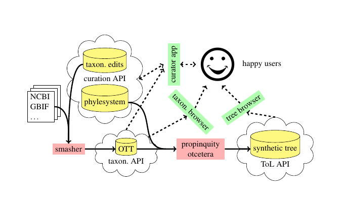
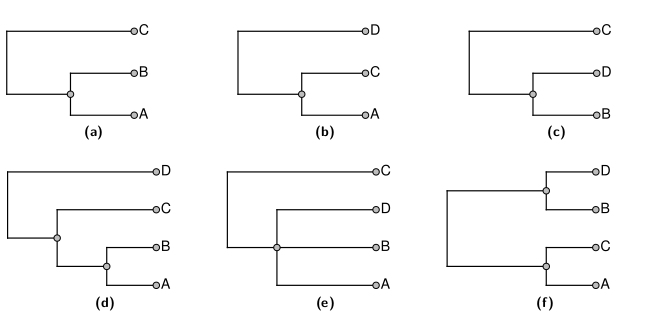

### Supertree analyses
  1. Gather a large set of partially overlapping estimated trees - These will be the data.
  1. Define an optimality criterion or procedure for resolving conflict.
  3. Produce a "supertree" that has all of the species
  in the sample.

### Input Tree Curation tool
https://tree.opentreeoflife.org/curator

  1. Map OTUs to a common taxonomy.
  2. Correction rooting of tree.
  3. Identification the ingroup.
  4. Add metadata (currently unused)

https://tree.opentreeoflife.org/curator/study/view/ot_1050

### Input tree storage
https://github.com/OpenTreeOfLife/phylesystem-1

  1. Versioned,
  2. Provenance of who uploaded and curated the data

### OT data model for input tree

  1. "NexSON" - JSON-ized NeXML
  2. OT curation results stored as name-spaced `ot:` tags

### ot:tags

    agents
    altLabel
    annotationEvents
    bootstrapValues
    branchLengthDescription
    branchLengthMode
    branchLengthTimeUnit
    candidateTreeForSynthesis
    comment
    curatedType
    curatorName
    dataDeposit
    focalClade
    focalCladeOTTTaxonName
    inGroupClade
    isTaxonExemplar
    messages
    MRCAName
    MRCAOttId
    nearestTaxonMRCAName
    nearestTaxonMRCAOttId
    nodeLabelDescription
    nodeLabelMode
    nodeLabelTimeUnit
    notIntendedForSynthesis
    originalLabel
    otherSupport
    otherSupportType
    ottId
    ottTaxonName
    otusElementOrder
    outGroupEdge
    posteriorSupport
    reasonsToExcludeFromSynthesis
    rootNodeId
    specifiedRoot
    studyId
    studyPublication
    studyPublicationReference
    studyYear
    tag
    taxonLink
    taxonLinkPrefixes
    treebaseOTUId
    treeElementOrder
    treesElementOrder
    unrootedTree

### Assembly of the Open Tree Taxonomy (OTT)

See [Rees and Cranston (2017)](https://bdj.pensoft.net/article/12581/)
  for details; that manuscript is the source of several of the next images and examples

An automated system creates OTT by merging:
  * 6 large taxonomies (NCBI, GBIF, IRMNG, SILVA, Index Fungorum, WoRMS)
  * 2 small taxonomies from publications Hibbett *et al.* (2007) and Schäferhoff *et al.* (2010)
  * a curated set of corrections.

## Goals of the summary tree creator
Paraphrasing [Redelings and Holder (2017)](https://peerj.com/articles/3058/),
the summary tree should:

  1. display no unsupported groups,
  2. defer to higher ranked trees,
  3. be as resolved as feasible, and
  4. displays as many groupings from input trees as possible.

### Using tree ranking
It is a hack, but it makes the results easy to understand (and improve by reranking). 

### Tricks for building the huge tree
Only about 65 thousand tips are exemplified in a phylogenetic input, so we:
  1. prune the taxonomy down to those 65 thousand,
  2. build the summary tree for that leaf set,
  3. graft the pruned taxa back on according to the taxonomy.

### Thanks! 
  * NSF
  * the entire Open Tree of Life team and community volunteers.
  * Gavin and David for inviting me

### Questions?
### My question for you:

What features would motivate you to contribute studies/trees to Open Tree?

(you can also give us feedback via our [gitter group chat channel](https://gitter.im/OpenTreeOfLife/public) )
