### How should we build a tree of about 2.6 million tips?

  1. Supermatrix
    * Create a huge matrix of all available data,
    * Use parsimony, distance, likelihood, or Bayesian methods to estimate a tree

### Problems:
  1. Hard to establish homology on this scale.
  2. Few models are appropriate on this scale.
  3. Hard to compute a reliable answer on this scale.
  4. **Lots** of missing data.

### How should we build a tree of about 2.6 million tips?

  1. <strike>Supermatrix</strike>
  2. Supertree analyses

### Supertree analyses
  1. Input: published estimates of phylogeny
  1. Choose a method/goals
  3. Output: a "supertree" that has all of the species
  in the inputs.

### Input Tree Curation tool
https://tree.opentreeoflife.org/curator

  1. Map OTUs to a common taxonomy.
  2. Correction rooting of tree.
  3. Identification the ingroup.
  4. Add metadata (currently unused)

https://tree.opentreeoflife.org/curator/study/view/ot_1050

### Input tree storage
https://github.com/OpenTreeOfLife/phylesystem-1

  1. Versioned,
  2. Provenance of who uploaded and curated the data

### Assembly of the Open Tree Taxonomy (OTT)

See [Rees and Cranston (2017)](https://bdj.pensoft.net/article/12581/instance/3545675/)
  for details

An automated system creates OTT by merging:
  * 6 large taxonomies (NCBI, GBIF, IRMNG, SILVA, Index Fungorum, WoRMS)
  * 2 small taxonomies from publications Hibbett *et al.* (2007) and Schäferhoff *et al.* (2010)
  * a curated set of corrections.

### Open Tree Taxonomy stats
  * currently at version 3.0 [info+download link](https://tree.opentreeoflife.org/about/taxonomy-version/ott3.0)
  * 3.1 million taxonomic names thought to be valid
  * 1.8 million synonyms
  * browsable at https://tree.opentreeoflife.org/taxonomy

## Goals of the summary tree creator
Paraphrasing [Redelings and Holder (2017)](https://peerj.com/articles/3058/),
the summary tree should:

  1. display no unsupported groups,
  2. defer higher ranked trees,
  3. be as resolved as feasible, and
  4. displays as many groupings from input trees as possible.

### Defn: a tree "displays group *X*"

Recall that the summary tree *S* will have more species than the input trees.
Consider:
  * some input tree *T1* that has a subtree called *X*,
  * imagine pruning the summary tree *S* down to the leaf set 
    of *T1*

If the pruned tree shows a subtree with only the leaves of *X*, then
  *S* displays *X*.

Inputs:

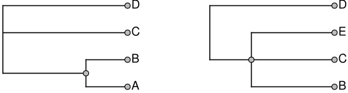

2 outputs that display both input clusters:

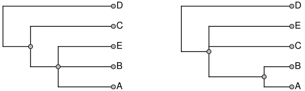

### A definition of "supported"
If edge *Y* in the summary tree *S* can be collapsed, and the
    resulting tree still displays the same set of input
    groups, then we say that edge *Y* was "unsupported".

If collapsing that edge means that the tree now longer
    displays input group *X*, then we say that "*Y* was supported by *X*"

### Using tree ranking
***Ad hoc***, but easy to understand + improve the tree:
 
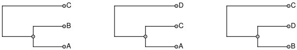 
inputs ↑ &nbsp; 3 solutions each displaying 2 splits ↓

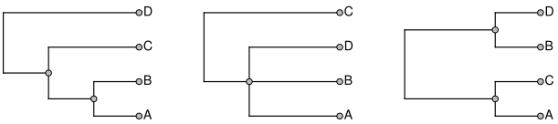

## Goals of the summary tree creator
Paraphrasing [Redelings and Holder (2017)](https://peerj.com/articles/3058/),
the summary tree should:

  1. display no unsupported groups,
  2. defer higher ranked trees,
  3. be as resolved as feasible, and
  4. displays as many groupings from input trees as possible.

### Summary tree problem
Finding the tree that maximizes the number of input
groups displayed is an **NP**-hard problem.

The problem is big:
  1. about 2.6 million tips,
  1. 987 input trees,
  2. 50 thousand phylogenetic input splits

### Tricks for building the huge tree
  1. prune the taxonomy down to those 65K tips are exemplified in a phylogenetic input,
  2. build the summary tree for that leaf set,
  3. graft the pruned taxa back on according to the taxonomy.

 
inputs ↑ &nbsp; exemplified versions ↓

### Divide and conquer
If a taxon is not contested by any single input tree, we 
      constrain it to be in the summary tree.

  1. Break up the problem into subproblems at these constrained nodes.
  2. Solve each subproblem.
  3. Glue subproblem solutions together

 
inputs ↑ &nbsp; and 2 subproblems ↓

This can result in lower ranked inputs being displayed: 
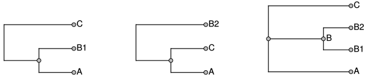 
inputs ↑   highest ranked  ↙  &nbsp; ↘ OT solution 

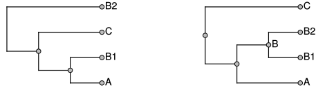

### How can we tell if we can add a clade to a subproblem?
We use the BUILD algorithm from [Aho *et al.* (1981)](http://www.bioinf.uni-leipzig.de/Leere/SS15/FortMeth/paper/aho-sag-1981.pdf)

In our case:
  1. Displayed splits, *D* = empty set.
  2. decode each input grouping into a rooted split: `{ingroup}|{outgroup}`
  3. For each split *x* in ranked order:
    if BUILD says *D* with *x* can all be displayed on a tree, add *x* to *D*
  4. Use BUILD to create the solution for *D*

### BUILD a tree from a set of splits *D*
  1. Make a graph with each leaf label as a node
  2. for each split *x* in *D*: draw a set of edges, each from the first member of the ingroup to each other label in the ingroup
  3. If there is only 1 connected component of the graph, *D* is not a set of compatible splits.
  4. Run BUILD on each connected components with the splits restricted to those leaves.
  5. If each succeed, the components are the children of the root of the tree.

 
inputs ↑ &nbsp; and solutions ↓
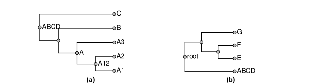

We keep notes about how the input trees support or conflict
with the summary:
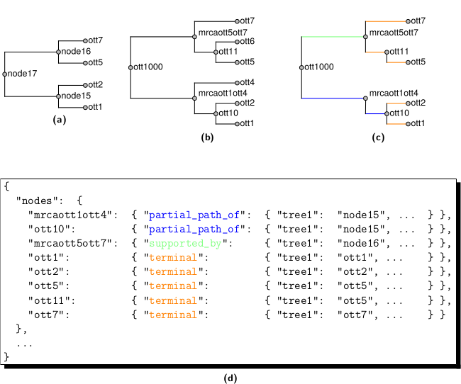

...So we can browse the tree and see support and conflict:
as in the case of [this grouping of birds](https://tree.opentreeoflife.org/opentree/argus/opentree10.4@mrcaott246ott5021)

### Thanks?

Thanks to NSF and the entire Open Tree of Life team and community volunteers.

(you can also give us feedback via our [gitter group chat channel](https://gitter.im/OpenTreeOfLife/public) )

### Challenges in large-scale phylogenetics

  1. Statistical
  2. Computational
  3. Data collection and cleaning

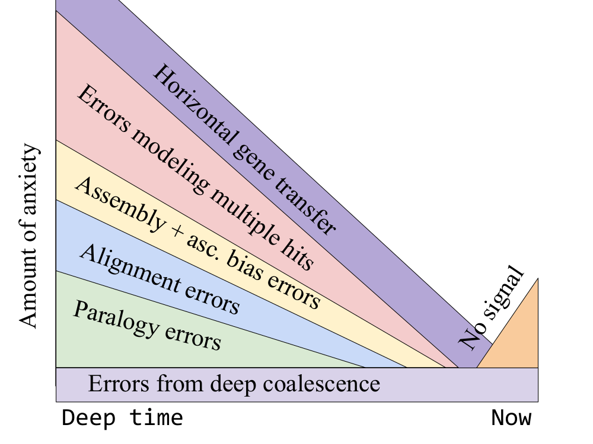

### Many types of tree in evo. biology

https://mtholder.github.io/reveal/latex/many_trees.pdf

### More Open Tree Slides after this point

 (just in case)

### Why is merging taxonomies hard?

  1. Taxonomic names are not identifiers.
    * A species has 1 valid name per classification, but there can be more than >1 classification.
      * Genus name could differ.
      * Both genus name and epithet can differ.
    * The same name can refer to different taxa governed by different codes.
    * Higher taxonomic names unregulated
  2. Very few taxon concept definitions are recorded.
  3. The largest databases tend to have less metadata about the names (e.g. authority info)
 

### Steps
  1. Merge taxonomies iteratively
  2. Align names in the next taxonomy to the current union taxonomy
    1. Find candidate alignments based on name matching,
    2. Consider placement, rank, shared descendants, *etc.* tp decide if a candidate is a good match

###  A cross-code homonym example

*Aporia sordida*
  * A tea plant [in the last gbif version we used](http://www.gbif.org/species/6880118/)
  * A butterfly [in the version of IRMNG we used](http://www.marine.csiro.au/mirrorsearch/ir_search.taxon_info?id=10682816)

(currently changed in both sources)

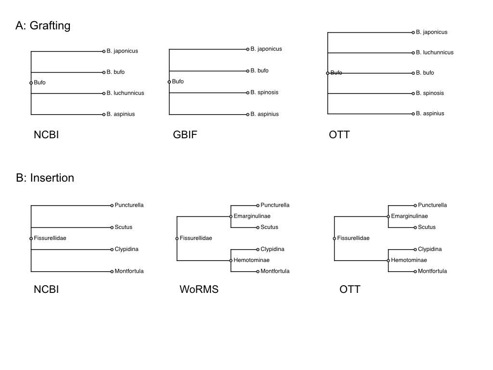 
Rees & Cranston, Fig. 2

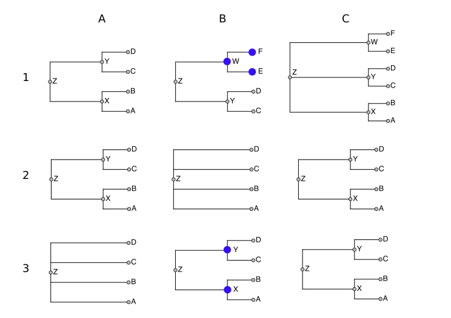 
Rees & Cranston, Fig. 3

 
Rees & Cranston, Fig. 3

Recent work: dealing with *incertae sedis* taxa more reasonably.

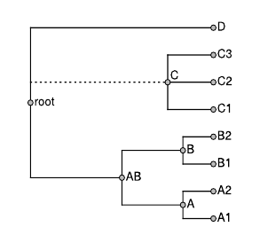

*incertae sedis* taxa ealt with as partial splits or alternative "phyloreferences"

AB = MRCA({A,B}) if it excludes {D}  

*vs*

AB = MRCA({A,B}) if it excludes {C,D}

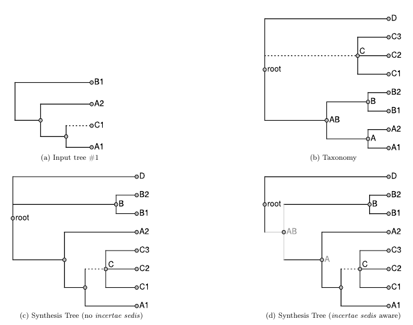

Choice of how to define a name can be non-obvious

