### Timeline

  * 2012: 3 year award 12 PIs over 11 institutions. Karen Cranston/Duke lead.
  * 2015: 2 year supplement to 3 bioinformatics labs
  * 2018: almost died
  * 2018: ABI award: 4 years KU and UC Merced

### How should we build a tree of about 2.6 million tips?

  1. Supermatrix
    * Create a huge matrix of all available data,
    * Use parsimony, distance, likelihood, or Bayesian methods to estimate a tree

### How should we build a tree of about 2.6 million tips?

  1. Supermatrix
    * Create a huge matrix of all available data,
    * Use parsimony, distance, likelihood, or Bayesian methods to estimate a tree

### Problems:
  1. Hard to establish homology on this scale.
  2. Few models are appropriate on this scale.
  3. Hard to compute a reliable answer on this scale.
  4. **Lots** of missing data.

### How should we build a tree of about 2.6 million tips?

  1. <strike>Supermatrix</strike>
  2. Supertree analyses

### Supertree analyses
  1. Gather a large set of partially overlapping estimated trees - These will be the data.
  1. Define an optimality criterion or procedure for resolving conflict.
  3. Produce a "supertree" that has all of the species
  in the sample.

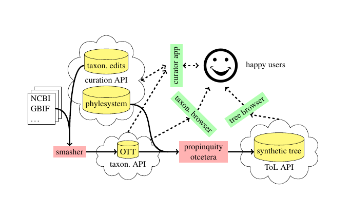

### Input Tree Curation tool
https://tree.opentreeoflife.org/curator

  1. Map OTUs to a common taxonomy.
  2. Correction rooting of tree.
  3. Identification the ingroup.
  4. Add metadata (currently unused)

https://tree.opentreeoflife.org/curator/study/view/ot_1050

### Input tree storage
https://github.com/OpenTreeOfLife/phylesystem-1

  1. Versioned,
  2. Provenance of who uploaded and curated the data

### Assembly of the Open Tree Taxonomy (OTT)

See [Rees and Cranston (2017)](https://bdj.pensoft.net/article/12581/)
  for details; that manuscript is the source of several of the next images and examples

An automated system creates OTT by merging:
  * 6 large taxonomies (NCBI, GBIF, IRMNG, SILVA, Index Fungorum, WoRMS)
  * 2 small taxonomies from publications Hibbett *et al.* (2007) and Schäferhoff *et al.* (2010)
  * a curated set of corrections.

### Why is merging taxonomies hard?

### Why is merging taxonomies hard?

  1. Taxonomic names are not identifiers.
    * 1 valid name per species per classification, but >1 classification.
      * Genus name could differ.
      * Both genus name and epithet can differ.
    * The same name can refer to different taxa governed by different codes.
    * Higher taxonomic names unregulated
  2. Very few taxon concept definitions are recorded.
  3. The largest databases tend to have less metadata about the names (e.g. authority info)
 

### Steps
  1. Merge taxonomies iteratively
  2. Align names in the next taxonomy to the current union taxonomy
    1. Find candidate alignments based on name matching,
    2. Consider placement, rank, shared descendants, *etc.* to decide if a candidate is a good match

###    A cross-code homonym example

*Aporia sordida*
  * A tea plant [in the last gbif version we used](http://www.gbif.org/species/6880118/)
  * A butterfly [in the version of IRMNG we used](http://www.marine.csiro.au/mirrorsearch/ir_search.taxon_info?id=10682816)

(currently changed in both sources)

 
Rees & Cranston, Fig. 2

 
Rees & Cranston, Fig. 3

### Open Tree Taxonomy stats
  * currently at version 3.0 [info+download link](https://tree.opentreeoflife.org/about/taxonomy-version/ott3.0)
  * 3.1 million taxonomic names thought to be valid
  * 1.8 million synonyms
  * browsable at https://tree.opentreeoflife.org/taxonomy

## Goals of the summary tree creator
Paraphrasing [Redelings and Holder (2017)](https://peerj.com/articles/3058/),
the summary tree should:

  1. display no unsupported groups,
  2. defer higher ranked trees,
  3. be as resolved as feasible, and
  4. displays as many groupings from input trees as possible.

### Defn: a tree "displays group *X*"

Recall that the summary tree *S* will have more species than the input trees.
Consider:
  * some input tree *T1* that has a subtree called *X*,
  * imagine pruning the summary tree *S* down to the leaf set 
    of *T1*

If the pruned tree shows a subtree with only the leaves of *X*, then
  *S* displays *X*.

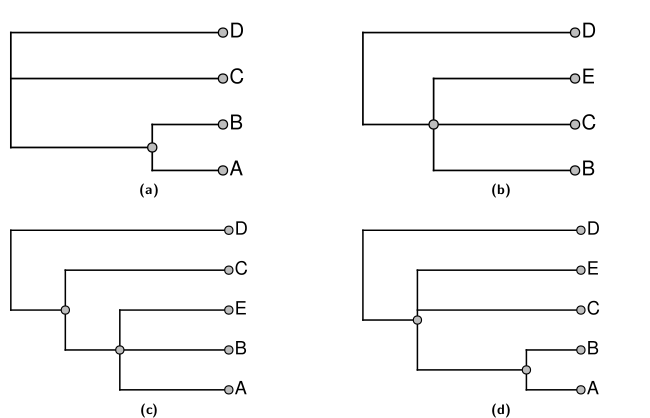

### A definition of "supported"
If edge *Y* in the summary tree *S* can be collapsed, and the
    resulting tree still displays the same set of input
    groups, then we say that edge *Y* was "unsupported".

If collapsing that edge means that the tree now longer
    displays input group *X*, then we say that "*Y* was supported by *X*"

### Using tree ranking
It is a hack, but it makes the results easy to understand (and improve by reranking). 
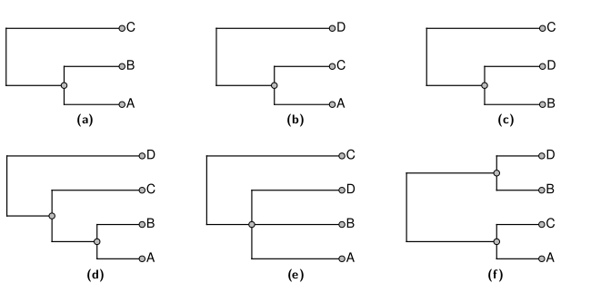

## Goals of the summary tree creator
Paraphrasing [Redelings and Holder (2017)](https://peerj.com/articles/3058/),
the summary tree should:

  1. display no unsupported groups,
  2. defer higher ranked trees,
  3. be as resolved as feasible, and
  4. displays as many groupings from input trees as possible.

### Summary tree problem
Finding the tree that maximizes the number of input
groups displayed is an **NP**-hard problem.

The problem is big:
  1. about 2.64 million tips,
  1. 987 input trees,
  2. 59 thousand clades from phylogenies

### Tricks for building the huge tree
Only about 65 thousand tips are exemplified in a phylogenetic input, so we:
  1. prune the taxonomy down to those 65 thousand,
  2. build the summary tree for that leaf set,
  3. graft the pruned taxa back on according to the taxonomy.

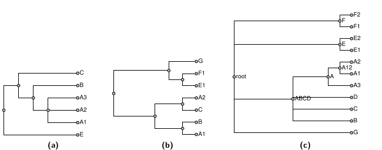 
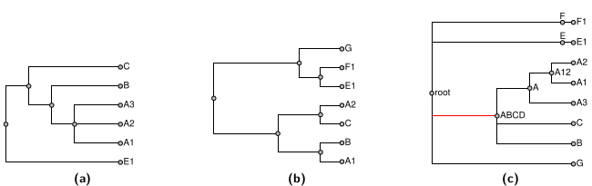

### Tricks for building the huge tree
  1. Prune to phylo-tips, then regraft
  2. If a taxon is not contested by any single input tree, we can 
      constrain it to be in the summary tree.
  3. Divide and conquer:
    1. Break up the problem into subproblems at these constrained nodes.
    2. Solve each subproblem,
    3. Glue them back together

 
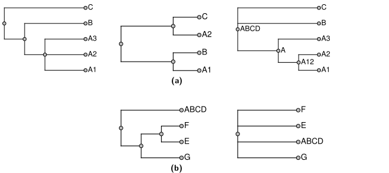

Note that decomposition can result in lower ranked inputs being displayed: 
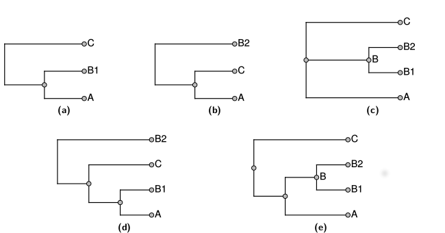

### How can we tell if we can add a clade to a subproblem?
We use the BUILD algorithm from [Aho *et al.* (1981)](http://www.bioinf.uni-leipzig.de/Leere/SS15/FortMeth/paper/aho-sag-1981.pdf)

In our case:
  1. Displayed splits, *D* = empty set.
  2. decode each input grouping into a rooted split: `{ingroup}|{outgroup}`
  3. For each split *x* in ranked order:
    if BUILD says *D* with *x* can all be displayed on a tree, add *x* to *D*
  4. Use BUILD to create the solution for *D*

### BUILD a tree from a set of splits *D*
  1. Make a graph with each leaf label as a node
  2. for each split *x* in *D*: draw a set of edges, each from the first member of the ingroup to each other label in the ingroup
  3. If there is only 1 connected component of the graph, *D* is not a set of compatible splits.
  4. Run BUILD on each connected components with the splits restricted to those leaves.
  5. If each succeed, the components are the children of the root of the tree.

 

gluing is easy: 

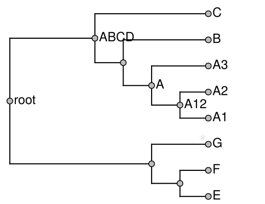

So is unpruning the taxonomy-only taxa: 
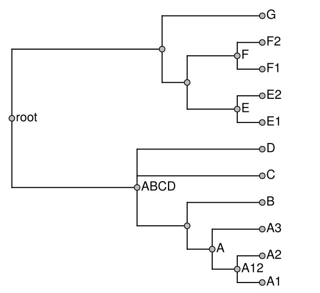

We keep notes about how the input trees support or conflict
with the summary:

...So we can browse the tree and see support and conflict:
as in the case of [this grouping of birds](https://tree.opentreeoflife.org/opentree/argus/opentree10.4@mrcaott246ott5021)

Recent work: dealing with *incertae sedis* taxa more reasonably.

*incertae sedis* taxa dealt with as partial splits or alternative phyloreferences

AB = MRCA({A,B}) if it excludes {D}   *vs*

AB = MRCA({A,B}) if it excludes {C,D}

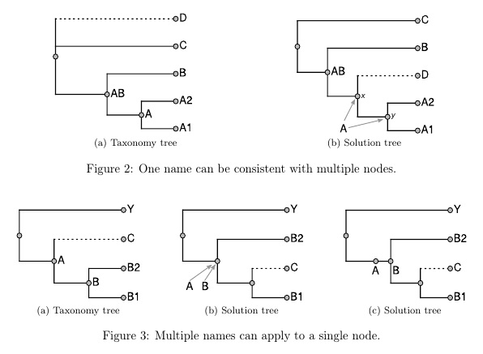

Choice of how to define a name can be non-obvious

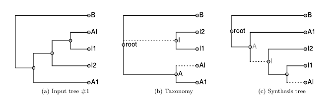

Recall that many *incertae sedis* groups are created in our taxonomy merging
 
Rees & Cranston, Fig. 3

### tree version 10.4 includes *incertae sedis* taxa

  * Added 3,737 new tips
  * Soon we will be able to add fossil taxa treating them as *incertae sedis*

### Open Tree problems

The quality chicken-and-egg problem

  * Having a good tree might inspire community engagment in curation
  * Having a good tree requires community engagment in curation

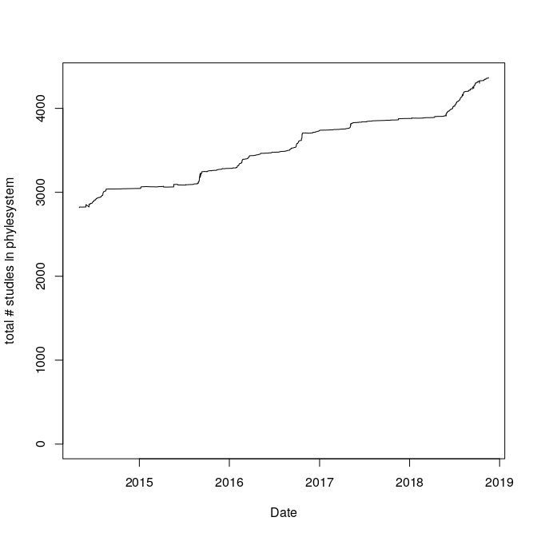

### Open Tree status

  * wrapping up some clean up of the infrastructure:
    * Summer 2018: 12 core repos, 4 full languages
    * Summer 2019 goal: 5 core repos, 3 full languages

### Open Tree short term goals

  * Better user experience for curation:
    * Better conflict viewing tools
    * "social" enhancements - better home page for authors/curators
    * More transparent status of the pipeline
  * Better integration with cool tree viz tools built by others (e.g. [OneZoom](http://www.onezoom.org/) and [LifeMap](https://www.univ-lyon1.fr/news/lifemap-exploring-the-tree-of-life-935319.kjsp))

### Open Tree longer term goals

  * Dated tree
  * Scraping more info from other resource
  * Automatic gene tree updating (McTavish lab)

## Some recent work on species delimitation

with:
 * Jeet Sukumaran (SDSU). *note* Jeet is recruiting! https://sukumaranlab.org/people/
 * Lacey Knowles U. Michigan

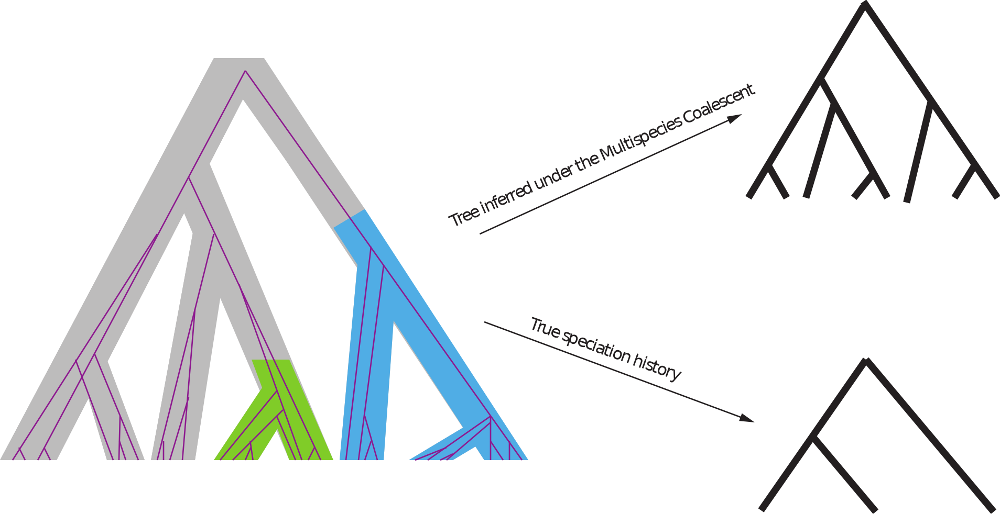

Sukumaran, Knowles (2017) "Multispecies coalescent delimits structure, not species"

#### Can estimate species completion rate from constraints

#### Estimates of species completion rate from 60-lineage simulations
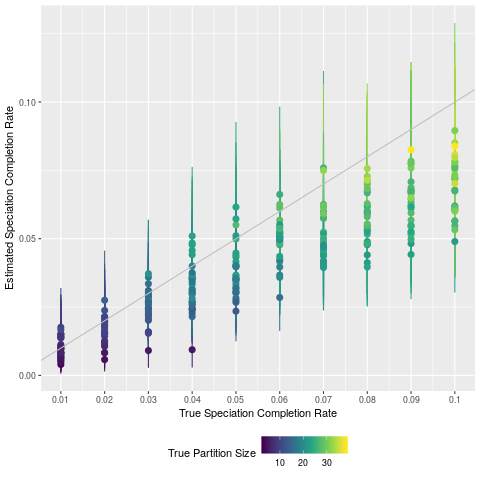

#### Can calculate con- or hetero-specific probabilities

For lineages, A, B, C, D, E and estimated tree T with species completion rate β:

* Pr(S=`{A,B,*};*` | β, T)
* Pr(S=`{A,*};{B,*};*` | β, T)

#### Can estimate species partitions

For lineages, A, B, C, D, E and estimated tree T with species completion rate β:

Pr(S=`{A,B};{C,D};{E}` | β, T)

#### Huge uncertainty for species partitions

15 lineage trees simulated:
  * Approx. 500,000 possible partitions
  * median # in the 95% credible interval: about 17,000

It is possible to be more confident about whether a pair of lineages are conspecific

Sukumaran, Knowles (2017) "Multispecies coalescent delimits structure, not species"

You can model speciation completion, but you should expect substantial uncertainty.

### Thanks! 
  * NSF
  * the entire Open Tree of Life team and community volunteers.
  * Gavin and David for inviting me

### Questions?
### My question for you:

What features would motivate you to contribute studies/trees to Open Tree?

(you can also give us feedback via our [gitter group chat channel](https://gitter.im/OpenTreeOfLife/public) )
